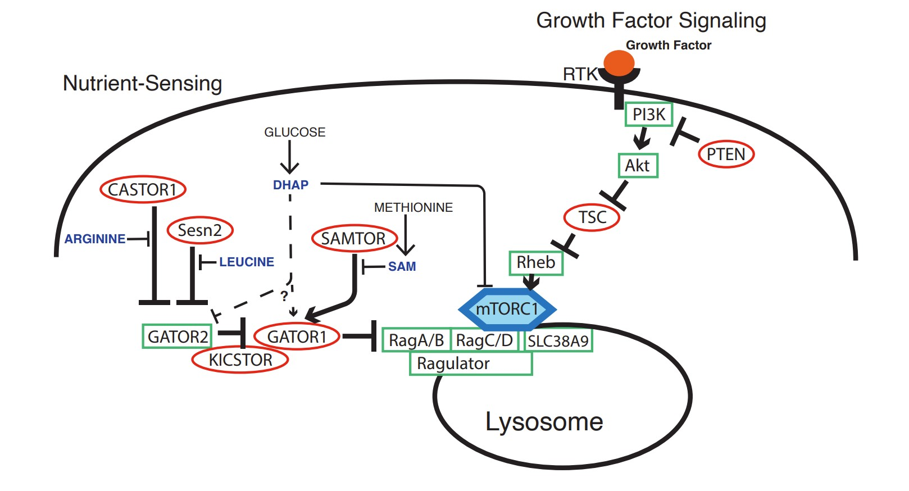

```{r setup, include=FALSE}
knitr::opts_chunk$set(echo = TRUE)
library(tibble)
library(kableExtra)
```

```{css echo=F}
a.button{
  display:inline-block;
  padding:0.3em 1em;
  border:0.1em solid #0F2E3D;
  margin: 0.5em 0.5em 0.5em 0.5em;
  border-radius: 0.25rem;
  box-sizing: border-box;
  text-decoration:none;
  font-family: 'Open Sans', sans-serif;
  font-weight:400;
  font-size: 0.9em;
  color: #0F2E3D;
  text-align:center;
  transition: all 0.2s;
}

a.button:hover{
 color:#FFFFFF;
 background-color:#0F2E3D;
}
```


```{r, echo = F}
df = tibble(
  
citation = c(

  
'A. A. Bielska, __C. F. Harrigan__, Y. J. Kyung, Q. Morris, W. Palm, and C. B. Thompson, “Activating mTOR mutations are detrimental in nutrient-poor conditions,” Cancer Res, p. CAN-22-0121, Jul. 2022 \n
<center>
  <i class="fa-solid fa-user-check"></i> &nbsp;
  <i class="ai ai-open-access ai-lg"></i>
  <a href="https://doi.org/10.1158/0008-5472.CAN-22-0121" class="button">paper</a>
  <a href="https://github.com/morrislab/mtor-rcc" class="button">code</a>
  
</center>
',

  
'Caitlin Timmons, Quaid Morris, and __Caitlin F. Harrigan__, “Regional Mutational Signature Activities in Cancer Genomes,” bioRxiv [preprint], Jan. 2022 \n 
<center>
  <i class="fa-solid fa-user-check"></i> &nbsp;
  <i class="ai ai-open-access ai-lg"></i>
  <a href="https://doi.org/10.1101/2022.01.23.477261" class="button">paper</a>
  <a href="https://github.com/morrislab/GenomeTrackSig" class="button">code</a>
</center>
',

'__Caitlin F Harrigan__\\*, Gabriella Morgenshtern\\*, Anna Goldenberg, and Fanny Chevalier. "Considerations for Visualizing Uncertainty in Clinical Machine Learning Models". Workshop: Realizing AI in Healthcare: Challenges Appearing in the Wild, CHI 2021 Online Virtual Conference (originally Yokohama, Japan), May. 2021. \n
<center>
  <i class="ai ai-open-access ai-lg"></i>
  <a href="Harrigan2021.pdf" class="button">paper</a>
</center>

',

'__Caitlin F Harrigan__, Yulia Rubanova, Quaid Morris, and Alina Selega. "TrackSigFreq : subclonal reconstructions based on mutation signatures and allele frequencies". In: Pacific Symposium on Biocomputing 25 (2020), pp. 238-249.
<center>
  <i class="fa-solid fa-user-check"></i> &nbsp;
  <i class="ai ai-open-access ai-lg"></i>
  <a href="https://doi.org/10.1142/9789811215636_0022" class="button">paper</a>
  <a href="https://github.com/morrislab/TrackSigFreq" class="button">code</a>
</center>
',

'Yulia Rubanova, Ruian Shi, __Caitlin F Harrigan__, Roujia Li, Jeff Wintersinger, Nil Sahin, Amit Deshwar, and Quaid Morris. "Reconstructing evolutionary trajectories of mutation signature activities in cancer using TrackSig". En. In: Nature Communications 11.1 (Feb. 2020). Number: 1 Publisher: Nature Publishing Group, pp. 1-12. 
<center>
  <i class="fa-solid fa-user-check"></i> &nbsp;
  <i class="ai ai-open-access ai-lg"></i>
  <a href="https://doi.org/10.1038/s41467-020-14352-7" class="button">paper</a>
  <a href="https://github.com/morrislab/TrackSigFreq" class="button">code</a>
</center>
'

),


image = c(

  '',
  '',
  '',
  '',
  ''

)
)

kable(df, escape = F, col.names = NULL) %>%
  kable_paper(html_font = "\"Open Sans\",  sans-serif")  

```


